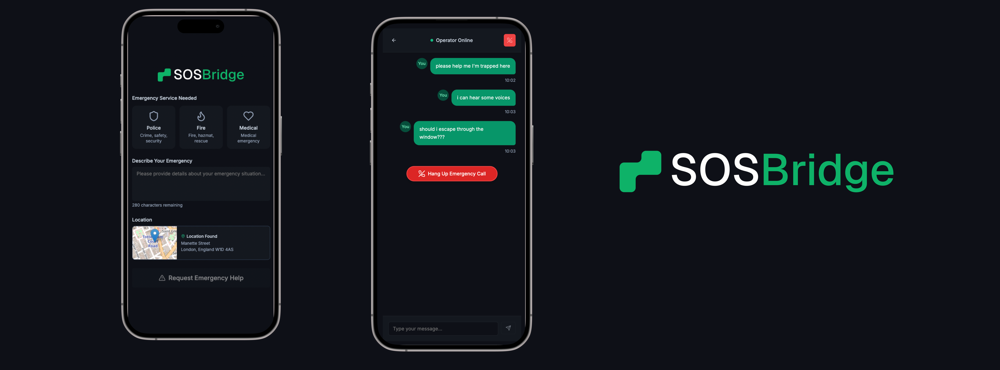

# SOSBridge - Emergency Communication System

Demo: **[YouTube link](https://youtu.be/yZuWo4Y7hWg)**

We believe emergency services are broken. In many places you can’t text 999/112 (in the UK you have to pre-register, in Germany you can only use fax??), you may not know the right number, you might not share the language, or you may be in danger if you speak. SOS Bridge lets you reach any emergency line worldwide without making a sound. All you have to do is tap pre-set buttons and type; we translate, compress the details, call emergency services for you and stream a clear voice message to them in real time using Eleven Labs. When it’s the worst day of your life, you should only have to press one button.

## Features

- **Emergency Form**: Collect emergency details including service needed, description, and location
- **Text-to-Speech**: Convert emergency messages to natural speech using ElevenLabs
- **Twilio Integration**: Make actual phone calls to emergency services
- **Real-time Communication**: Two-way communication with emergency operators
- **Speech Recognition**: Transcribe operator responses back to text
- **Modern UI**: Clean, accessible interface designed for emergency situations

## How It Works

1. **Emergency Report**: User fills out an emergency form with details about their situation
2. **Message Generation**: System creates a natural language message from the form data
3. **Speech Conversion**: Message is converted to speech using ElevenLabs TTS API
4. **Emergency Call**: System calls emergency services using Twilio and plays the audio message
5. **Response Handling**: Operator responses are recorded and transcribed back to text
6. **Ongoing Communication**: User can send additional messages that are converted to speech and played in the call

## Technology Stack

- **Frontend**: Next.js 13, React, TypeScript, Tailwind CSS
- **Text-to-Speech**: ElevenLabs API
- **Phone Calls**: Twilio API
- **Speech Recognition**: ElevenLabs Speech-to-Text
- **UI Components**: Radix UI, Framer Motion
